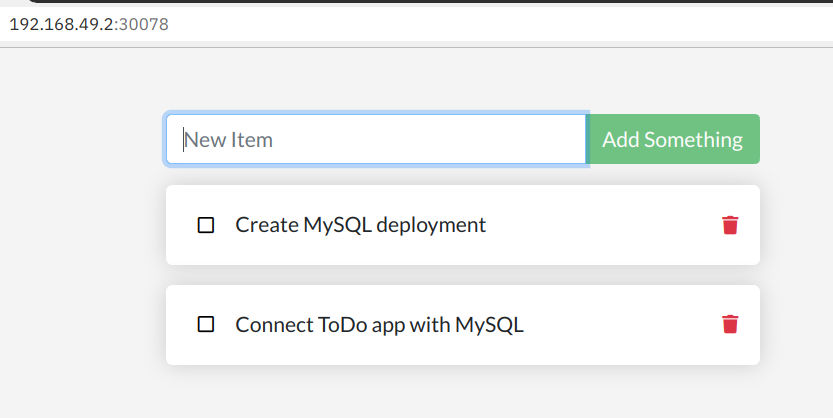

# Lab 1: Deploy ToDo app stand-alone

In the original Docker tutorial, the command to deploy the ToDo app stand-alone is:

```
$ docker run -dp 3000:3000 getting-started
```

* The image `getting-started` was created in a previous step locally.
* `-p 3000:3000` maps Container port 3000 on local port 3000.

The file [deploy/todo-v1.yaml](../deploy/todo-v1.yaml) contains the configuration for the equivalent Kubernetes deployment and service:

```
apiVersion: apps/v1
kind: Deployment
metadata:
  name: todo-app
  labels:
    app: todo
spec:
  replicas: 1
  selector:
    matchLabels:
      app: todo
  template:
    metadata:
      labels:
        app: todo
    spec:
      containers:
      - name: todo
        image: haraldu/getting-started:latest
        ports:
        - containerPort: 3000
---
apiVersion: v1
kind: Service
metadata:
  name: todo
spec:
  selector:
    app: todo
  type: NodePort
  ports:
    - protocol: TCP
      port: 3000
```

Here we are using my version of the getting-started container image on Docker Hub.

The ToDo app runs on port 3000 which will be exposed a NodePort.

1. Apply the configuration:

    ```
    $ kubectl apply -f deploy/todo-v1.yaml
    ```

2. Check the result with

    ```
    $ kubectl get pod
    NAME                       READY   STATUS    RESTARTS   AGE
    todo-app-f8549b989-9cbdr   1/1     Running   0          44s
    ```

3. Check the logs with

    ```
    $ stern todo
    + todo-app-f8549b989-9cbdr › todo
    todo-app-f8549b989-9cbdr todo Using sqlite database at /etc/todos/todo.db
    todo-app-f8549b989-9cbdr todo Listening on port 3000
    ```

    This means the app started on port 3000 and is using sqlite.

4. Find the number of the NodePort with

    ```
    $ kubectl get svc
    NAME         TYPE        CLUSTER-IP       EXTERNAL-IP   PORT(S)          AGE
    kubernetes   ClusterIP   10.96.0.1        <none>        443/TCP          3d1h
    todo         NodePort    10.101.211.232   <none>        3000:30675/TCP   4m26s
    ```

    The kubernetes service is there by default.
    The PORT(S) column shows port 3000 is mapped on NodePort 30675. The NodePort number will be different for your deployment.

    Another way to programmatically find the NodePort is using the ability of `kubectl`to output JSON data:

    ```
    $ kubectl get svc todo --output 'jsonpath={.spec.ports[*].nodePort}'
    ```

5. IP Address

    A NodePort is mapped to the IP address of each Kubernetes worker node. Minikube has 1 worker node, its IP address is this:

    ```
    $ minikube ip
    ```

    The URL of the ToDo app is then:

    ``` 
    $ echo "http://$(minikube ip):$(kubectl get svc todo --output 'jsonpath={.spec.ports[*].nodePort}')"
    ```

    Output for example:
    ```
    http://192.168.49.2:30078
    ```

    Minikube has a shortcut for this:

    ```
    minikube service list
    ```

    Result:

    ```
    |-------------|------------|--------------|---------------------------|
    |  NAMESPACE  |    NAME    | TARGET PORT  |            URL            |
    |-------------|------------|--------------|---------------------------|
    | default     | kubernetes | No node port |
    | default     | todo       |         3000 | http://192.168.49.2:30675 |
    | kube-system | kube-dns   | No node port |
    |-------------|------------|--------------|---------------------------|
    ```

    Copy the URL in your browser. This should open the ToDo app. Test if it works. 

    If you (or Kubernetes) redeploy the app, all data is gone because it isn't persisted, the sqlite database resides inside the container.

    

---

**Next Step:** [Create MySQL deployment](lab2.md) 
