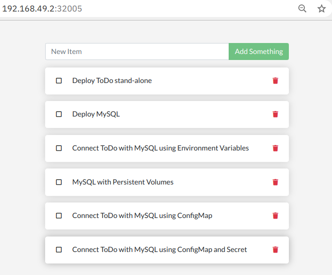

# Overview

Based on the [Docker Getting Started Tutorial](https://github.com/docker/getting-started). The Docker tutorial uses a Node.js based ToDo app. This app is packaged as a Container image and then run on Docker, first stand-alone using a built-in database, and then as a multi-container app with docker-compose, running MySQL as database in a second container.



We will use the information in the Docker commands of the tutorial to create Kubernetes configurations. 

At one point the Docker Getting Started Tutorial has you publish the ToDo app container image on Docker Hub in your own repository. In this Hands-on I am using my version of the getting-started image, but of course you can use your own.

The instructions in this lab are based on Minikube. They should work -- with some modifications -- with the Kubernetes that is part of Docker Desktop, with K3d, Kind, or any other Kubernetes distribution. Your mileage may vary ...

## Prerequisites

* [Docker](https://docs.docker.com/desktop/)
* [Minikube](https://minikube.sigs.k8s.io/docs/start/)
* [git](https://git-scm.com/downloads)
* [kubectl](https://kubernetes.io/docs/tasks/tools/install-kubectl/)
* [stern](https://github.com/wercker/stern)

You may not know `stern`: stern allows you to tail multiple pods on Kubernetes and multiple containers within the pod. Each result is color coded for quicker debugging.

## Get the code

```
$ git clone https://github.com/Harald-U/kubernetes-handson.git
$ cd kubernetes-handson
```

## Prepare Minikube

This is the minimum setup:

```
$ minikube start --cpus 2 --memory 4096 --driver docker
```

By default, on Linux and macOS this will use Docker as driver, no virtualization. 


## Labs

The ToDo app we are going to deploy is based on Node.js. It can run "stand-alone" and will use a built in SQLite database then. Or it can be used together with MySQL. During the labs we add more and more Kubernetes features.

- [**Lab 1**](docs/lab1.md) Deploy ToDo stand-alone
- [**Lab 2**](docs/lab2.md) Deploy MySQL
- [**Lab 3**](docs/lab3.md) Connect ToDo with MySQL using Environment Variables
- [**Lab 4**](docs/lab4.md) MySQL with Persistent Volumes
- [**Lab 5**](docs/lab5.md) Connect ToDo with MySQL using ConfigMap
- [**Lab 6**](docs/lab6.md) Connect ToDo with MySQL using ConfigMap and Secret